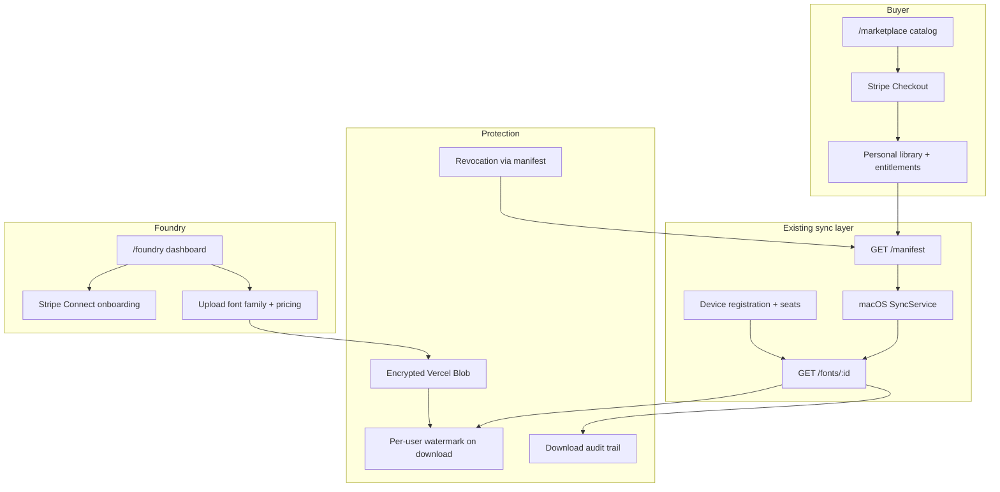

# Font Marketplace + Protection Platform

## Goal

Turn syncFont from a personal sync tool into a **two-sided marketplace**: foundries publish desktop font families, buyers purchase through syncFont, and licensed fonts auto-install on entitled devices via the existing macOS sync loop.

**Launch choices (confirmed):**

- Foundry **self-serve** with Stripe Connect payouts
- **Desktop-only** licenses with seat limits (1 / 5 / unlimited)

**Honest constraint:** installed desktop fonts remain copyable once on disk. Protection = **license enforcement + deterrence + traceability**, not unbreakable DRM.

---

## Architecture overview

---

## Data model (new tables in `[src/lib/db/schema.ts](src/lib/db/schema.ts)`)

| Table                 | Purpose                                                                                 |
| --------------------- | --------------------------------------------------------------------------------------- |
| `foundries`           | Seller profile linked to `userId`, Stripe Connect account ID, payout status             |
| `font_families`       | Marketplace product (name, description, foundry, status: draft/published)               |
| `font_family_assets`  | Individual font files for a family (encrypted blob refs, sha256, weight/style metadata) |
| `license_tiers`       | Per-family pricing: `seats` (1, 5, -1 for unlimited), `priceCents`, `stripePriceId`     |
| `purchases`           | Stripe checkout session / payment intent, buyer, family, tier, amount                   |
| `entitlements`        | Active grant: `userId`, `familyId`, `maxDevices`, `status`, `expiresAt?`, `purchaseId`  |
| `entitlement_devices` | Which devices are consuming a seat for a given entitlement                              |
| `download_events`     | Audit: user, device, font asset, IP, timestamp, watermark id                            |

**Keep existing tables unchanged for personal uploads:**

- `[fonts](src/lib/db/schema.ts)` + `[libraries](src/lib/db/schema.ts)` remain the personal-upload path
- Manifest becomes a **union** of personal fonts + entitled marketplace assets

Add `source` field to manifest entries: `personal` | `marketplace`.

---

## Phase 1 — Foundation: schema, foundry roles, storage split

**Backend**

- Extend schema + run `npm run db:push`
- New modules:
  - `[src/lib/marketplace/](src/lib/marketplace/)` — products, families, catalog queries
  - `[src/lib/entitlements.ts](src/lib/entitlements.ts)` — grant, revoke, seat checks
  - `[src/lib/foundry.ts](src/lib/foundry.ts)` — seller profile + Connect account state
- Split blob paths:
  - Personal: `libraries/{libraryId}/fonts/...` (existing)
  - Marketplace: `marketplace/{familyId}/assets/...` (encrypted at upload)
- Add `fontSource` enum to `[src/lib/types.ts](src/lib/types.ts)`

**Access**

- Extend `[src/lib/access.ts](src/lib/access.ts)`:
  - `requireFoundryOwner(foundryId)`
  - `requireEntitledFontDownload(userId, assetId, deviceId?)`

**Manifest change** — `[src/lib/manifest.ts](src/lib/manifest.ts)`:

- Merge personal library fonts + active entitlements for the user
- Include `source`, `entitlementId`, `revoked: false` per entry
- Etag covers both sets (revocation changes etag → triggers re-sync)

---

## Phase 2 — Stripe Connect + checkout

**Dependencies:** add `stripe` SDK (ask before install per ship-it; required for this feature).

**Stripe setup (Connect marketplace pattern)**

- Platform account + Connect Express accounts for foundries
- Use Checkout Sessions with `transfer_data.destination` + `application_fee_amount` (platform take rate, e.g. 20%)
- Webhook handler: `[src/app/api/webhooks/stripe/route.ts](src/app/api/webhooks/stripe/route.ts)`
  - `checkout.session.completed` → create `purchase` + `entitlement`
  - `account.updated` → update foundry payout/onboarding status

**API routes**

| Route                            | Purpose                                    |
| -------------------------------- | ------------------------------------------ |
| `POST /api/foundry/connect`      | Start Stripe Connect onboarding            |
| `GET /api/foundry/me`            | Foundry dashboard state                    |
| `POST /api/marketplace/checkout` | Create Checkout Session for a license tier |
| `GET /api/marketplace/purchases` | Buyer's purchase history                   |

**Env vars:** `STRIPE_SECRET_KEY`, `STRIPE_WEBHOOK_SECRET`, `STRIPE_CONNECT_CLIENT_ID` (if needed), `PLATFORM_FEE_PERCENT`

---

## Phase 3 — Foundry self-serve portal

**Web UI** (new routes under `[src/app/](src/app/)`):

- `/foundry` — dashboard (sales, onboarding status, payout link)
- `/foundry/products` — list families
- `/foundry/products/new` — create family + upload font files
- `/foundry/products/[id]` — edit metadata, set license tier prices, publish/unpublish

**Upload flow**

- Foundry uploads `.otf`/`.ttf` → validate via existing `[src/lib/font-validation.ts](src/lib/font-validation.ts)`
- Encrypt buffer before `put()` to Vercel Blob (AES-256-GCM, key from `FONT_ENCRYPTION_KEY` env)
- Store ciphertext + IV + auth tag in DB metadata

**Publishing gate**

- Foundry must complete Stripe Connect onboarding (`charges_enabled` + `payouts_enabled`) before publish

---

## Phase 4 — Marketplace browse + purchase

**Web UI**

- `/marketplace` — searchable catalog (family cards, foundry name, price range)
- `/marketplace/[familyId]` — specimen page, license tier picker (1 / 5 / unlimited desktop), Buy button
- `/library/purchases` — buyer's entitled fonts + device usage ("2 of 5 seats used")

**Purchase → sync path**

1. Buyer completes Stripe Checkout
2. Webhook creates entitlement
3. Next manifest poll includes new family assets
4. macOS app downloads + installs (existing `[SyncService.swift](apps/SyncFont/Shared/Services/SyncService.swift)` loop)

No change to buyer's personal upload UX on `[src/app/page.tsx](src/app/page.tsx)`.

---

## Phase 5 — License enforcement + device seats

**Device seat logic** (`[src/lib/devices.ts](src/lib/devices.ts)` + new entitlement device binding)

On device register or font download:

1. Load user's active entitlements
2. For marketplace fonts, count devices in `entitlement_devices` for that entitlement
3. If `deviceId` not yet bound and `count >= maxDevices` → reject with `403` + clear error ("License allows 5 devices. Deactivate one in settings.")
4. On successful download, bind device to entitlement

**New API**

- `GET /api/entitlements` — list entitlements + seat usage
- `DELETE /api/entitlements/:id/devices/:deviceId` — buyer deactivates a device to free a seat
- `POST /api/libraries/:id/devices` — extend existing route to enforce seat limits

**Download gate** — update `[src/app/api/libraries/[id]/fonts/[fontId]/route.ts](src/app/api/libraries/[id]/fonts/[fontId]/route.ts)` (or new marketplace download route):

- Personal fonts: existing owner check
- Marketplace fonts: entitlement + device seat + signed short-lived token

**Signed download tokens**

- `POST /api/marketplace/assets/:assetId/download-token` → JWT (5 min TTL, binds `userId` + `deviceId` + `assetId`)
- Download endpoint validates token before decrypting/streaming

---

## Phase 6 — Protection layers

### 6a. Encryption at rest

- New `[src/lib/crypto/fonts.ts](src/lib/crypto/fonts.ts)`: `encryptFontBuffer` / `decryptFontBuffer`
- Marketplace uploads always encrypted; personal uploads stay plaintext (optional later)
- Server decrypts only after entitlement check

### 6b. Forensic watermarking

- Add `fontkit` dependency for OpenType table manipulation
- New `[src/lib/watermark.ts](src/lib/watermark.ts)`: embed `syncfont:{purchaseId}:{userId}` in `name` table / unique ID field on each authorized download
- Record `watermarkId` in `download_events`

### 6c. Revocation

- Entitlement `status`: `active` | `revoked` | `expired`
- Admin/foundry refund flow sets `revoked`
- Manifest excludes revoked assets → etag changes

### 6d. Native app: uninstall on revocation

**Gap today:** `[SyncService.swift](apps/SyncFont/Shared/Services/SyncService.swift)` only installs new fonts; never removes fonts dropped from manifest.

Add:

- Compare manifest font IDs vs `installedFontIds`
- Remove files from `~/Library/Fonts` for IDs no longer in manifest
- New `FontInstalling.uninstallFont(filename:)` in `[MacPlatformServices.swift](apps/SyncFont/macOS/MacPlatformServices.swift)`
- Handle seat-limit errors in UI with link to web device management

### 6e. Audit logging

- Log every marketplace download to `download_events`
- Foundry dashboard: download count per family
- Buyer library: "Licensed devices" compliance view

---

## Phase 7 — Legal + ops (minimal v1)

- Static pages: `/legal/foundry-terms`, `/legal/buyer-license`, `/legal/refund-policy`
- Foundry publish requires accepting seller terms (checkbox)
- Platform admin role (env `ADMIN_USER_IDS`) for takedown: unpublish family, revoke entitlements

---

## Key file touchpoints

| Area               | Files                                                                                                                                                                              |
| ------------------ | ---------------------------------------------------------------------------------------------------------------------------------------------------------------------------------- |
| Schema             | `[src/lib/db/schema.ts](src/lib/db/schema.ts)`                                                                                                                                     |
| Manifest merge     | `[src/lib/manifest.ts](src/lib/manifest.ts)`                                                                                                                                       |
| Download + decrypt | new `src/app/api/marketplace/assets/[assetId]/route.ts`                                                                                                                            |
| Stripe             | new `src/lib/stripe/` + webhook route                                                                                                                                              |
| Foundry portal     | `src/app/foundry/**`                                                                                                                                                               |
| Marketplace        | `src/app/marketplace/**`                                                                                                                                                           |
| macOS sync         | `[apps/SyncFont/Shared/Services/SyncService.swift](apps/SyncFont/Shared/Services/SyncService.swift)`, `[MacPlatformServices.swift](apps/SyncFont/macOS/MacPlatformServices.swift)` |
| Docs               | `[docs/MAP.md](docs/MAP.md)`                                                                                                                                                       |

---

## Suggested implementation order (PRs)

1. **PR1 — Schema + entitlements engine** (no payments; manual grant for testing)
2. **PR2 — Manifest merge + marketplace download with seat checks**
3. **PR3 — Encryption + watermarking on download**
4. **PR4 — Stripe Connect + foundry onboarding**
5. **PR5 — Foundry portal (upload, pricing, publish)**
6. **PR6 — Marketplace browse + checkout**
7. **PR7 — Native uninstall + seat error UX**
8. **PR8 — Audit dashboard + legal pages**

Each PR should be independently testable. PR1–3 can be validated with seed data before Stripe is wired.

---

## Testing strategy

- Unit tests: entitlement seat math, encrypt/decrypt roundtrip, watermark embed
- Integration: webhook → entitlement → manifest includes font
- Manual: Stripe test mode checkout → macOS sync installs → revoke → font removed on next poll
- Edge cases: buy 1-seat license on 2nd Mac → blocked; deactivate device → succeeds

---

## Out of scope (v1)

- Webfont hosting / domain-restricted CDN (desktop-only launch)
- iPad font install (scaffold remains; marketplace purchases visible but install gated)
- Windows/Linux native apps
- Subscription licensing (one-time purchase per tier only)
- Team/org accounts (single buyer user per entitlement)

